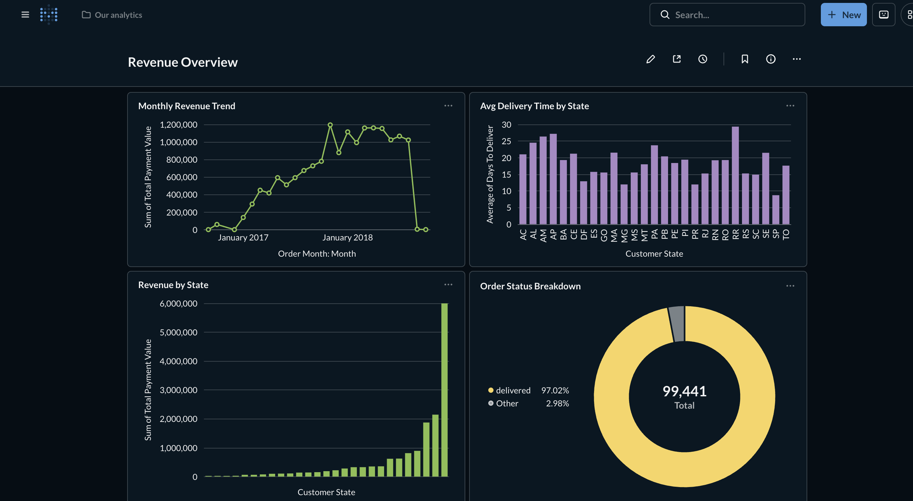
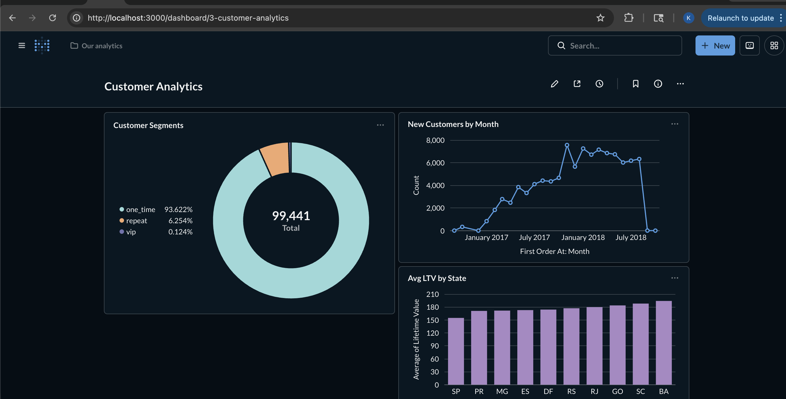
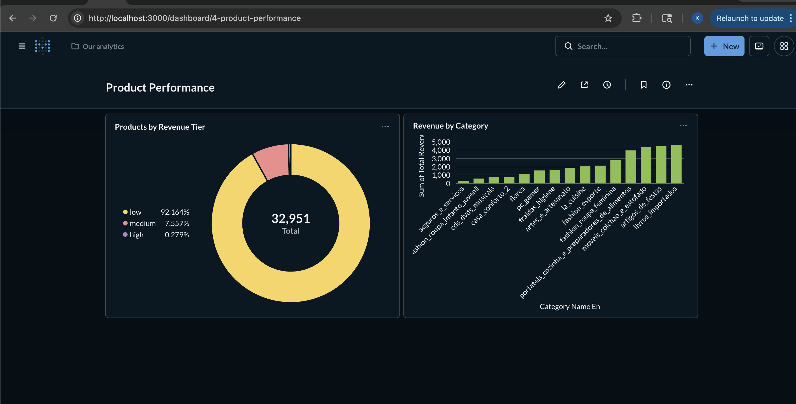

# Retail Analytics Platform


An end-to-end data engineering project simulating a production-grade retail analytics stack — built entirely with free, open-source tools.

## What this project does

Ingests 100k+ orders from a Brazilian e-commerce platform, validates data quality, models it into a dimensional warehouse, orchestrates the full pipeline on a schedule, and serves business dashboards — covering the complete data stack from raw ingestion through BI consumption.

## Architecture
```
Supabase Postgres (source)
    |
    v
DuckDB — local data warehouse
    |
    v
Great Expectations — data quality gates (raw + marts)
    |
    v
dbt Core — modular transformations
|-- staging/       6 models  (views)
|-- intermediate/  2 models  (views)
└-- marts/         3 models  (tables + incremental)
    |
    v
Prefect — orchestration + scheduling (daily 6am)
    |
    v
Metabase — self-serve BI dashboards
    |
    v
GitHub Actions — CI/CD (dbt run + test on every push)
```

## Stack

| Layer | Tool | Why |
|---|---|---|
| Source database | Supabase (Postgres) | Simulates production backend DB |
| Warehouse | DuckDB | Columnar, local, Parquet-native |
| Transformation | dbt Core | Modular, testable, documented |
| Data quality | Great Expectations | Expectation suites, HTML reports |
| Orchestration | Prefect | Pythonic DAGs, free cloud tier |
| BI | Metabase | Self-serve analytics, free |
| Infra | Docker Compose | Reproducible local environment |
| CI/CD | GitHub Actions | Automated testing on every push |

## Data model

### Sources (raw layer)
9 tables ingested from Postgres into DuckDB raw schema:
`orders`, `customers`, `order_items`, `payments`, `reviews`, `products`, `sellers`, `geolocation`, `category_translation`

### Staging layer (views)
Clean and rename raw tables — one model per source:
`stg_orders`, `stg_customers`, `stg_order_items`, `stg_payments`, `stg_products`, `stg_sellers`

### Intermediate layer (views)
Join and enrich staged tables:
- `int_orders_enriched` — orders + customers + payments + items
- `int_order_items_enriched` — items + products + sellers + translations

### Mart layer (tables)
- `fct_orders` — **incremental** fact table, one row per order
- `dim_customers` — customer dimension with LTV and segmentation (vip / repeat / one_time)
- `dim_products` — product dimension with revenue tier classification

### Snapshot
- `customers_snapshot` — SCD Type 2 tracking of customer city/state changes over time

## Data quality

Two quality gates in the pipeline:

**Gate 1 — raw data (Great Expectations)**
Runs before any transformation. Blocks the pipeline if raw data fails expectations.
- `orders.raw` — 6 expectations (PK uniqueness, status values, row count, timestamps)
- `payments.raw` — 5 expectations (payment values > 0, valid payment types, installment range)
- `products.raw` — 4 expectations (PK uniqueness, dimension values > 0)

**Gate 2 — mart data (dbt tests)**
28 tests across all models covering uniqueness, not-null, accepted values, and referential integrity.

## Pipeline stats

| Metric | Value |
|---|---|
| Total orders | 99,441 |
| Total customers | 99,441 |
| Unique products | 32,951 |
| dbt models | 11 |
| dbt tests | 28 (28/28 passing) |
| GE expectations | 15 |
| States covered | 27 |

## Dashboards

Three Metabase dashboards built on the mart layer:

**Revenue Overview**



**Customer Analytics**



**Product Performance**



## Incremental loading strategy

`fct_orders` uses dbt incremental materialization — on each pipeline run only orders newer than the latest `purchased_at` in the existing table are processed. This simulates a real production pattern where a fact table grows daily without full rebuilds.

To simulate incremental loading with this static dataset:

```bash
# load 80% of data first
python infra/load_raw_data.py --sample 0.8

# run pipeline
python orchestration/flows/retail_pipeline.py

# load remaining 20%
python infra/load_raw_data.py --sample 1.0

# run again — only new rows processed
python orchestration/flows/retail_pipeline.py
```

## Running locally

**Prerequisites:** Docker Desktop, Python 3.11+, Git

```bash
# clone
git clone https://github.com/nambiark/retail-analytics-platform.git
cd retail-analytics-platform

# environment
python3 -m venv .venv
source .venv/bin/activate
pip install -r requirements.txt

# environment variables
cp .env.example .env
# fill in your Postgres credentials

# start Docker services
docker compose up -d

# run full pipeline
python orchestration/flows/retail_pipeline.py

# open BI dashboards
open http://localhost:3000
```

## CI/CD

GitHub Actions runs on every push to `main` or `dev`:
1. Connects to Supabase Postgres
2. Loads raw tables into DuckDB
3. Runs all 11 dbt models
4. Runs all 28 dbt tests
5. Uploads artifacts on failure for debugging

## Design decisions

**DuckDB over Snowflake locally** — DuckDB runs entirely in-process with no infrastructure, supports Parquet natively, and is increasingly used in production. Snowflake can be swapped in by changing the dbt profile.

**Two quality gates** — Great Expectations catches issues in raw data before transformation (wrong formats, missing PKs, out-of-range values). dbt tests catch issues introduced during transformation (bad joins, unexpected nulls). Both layers are needed.

**Prefect over Airflow** — Prefect requires no infrastructure to run locally (`python flow.py` just works), supports dynamic workflows natively, and has a free cloud tier for monitoring. For a team already on Airflow the flow logic is identical — just different decorators.

**Incremental fact table** — `fct_orders` uses incremental materialization with `purchased_at` as the high-watermark. In production this would be a `loaded_at` timestamp from the ingestion layer to handle late-arriving data.

**SCD Type 2 for customers** — the dbt snapshot tracks historical changes to customer location. In production this matters for accurate geographic reporting — a customer who moved states shouldn't skew historical regional revenue.

## Project structure

```
retail-analytics-platform/
|-- .github/
|   └-- workflows/          # CI/CD pipelines
|-- data_quality/            # Great Expectations suites + checkpoints
|-- dbt/
|   |-- models/
|   |   |-- staging/         # 6 models
|   |   |-- intermediate/    # 2 models
|   |   └-- marts/           # 3 models
|   |-- snapshots/           # SCD Type 2
|   └-- dbt_project.yml
|-- dashboards/
|   └-- sql/                 # underlying dashboard queries
|-- infra/                   # data loading scripts
|-- orchestration/
|   |-- flows/               # Prefect flows
|   └-- tasks/               # individual task definitions
|-- screenshots/             # dashboard screenshots
|-- docker-compose.yml
|-- requirements.txt
└-- README.md

```